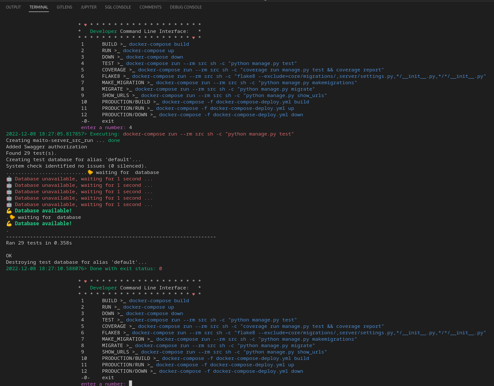

# **INTRODUCE**  
### This is My server using for Web-Backend-API purpose, that is written by [Python](https://www.python.org/) - [Django_REST_Framework](https://www.django-rest-framework.org/s)  

**Developer CLI**  
The special custom tool Command Line Interface to saving time when using docker in the project  ss

-> just add or choose the option, the tool will do that stuff for you  

to use this tool:
- make sure that you are installed [Python](https://www.python.org/), [Docker](https://docs.docker.com/engine/install/), [Docker Compose](https://docs.docker.com/compose/install/) in your computer
- at the root_project folder: type `python cmd.py` 
- and enjoy it!  

**Tech & Tool using**
- [Docker](https://www.docker.com/)
- [Docker Compose](https://docs.docker.com/compose/)
- [EC2 - Amazon Elastic Compute Cloud](https://en.wikipedia.org/wiki/Amazon_Elastic_Compute_Cloud)
- [GitHub Action](https://github.com/features/actions)
- [GitHub Runner](https://github.com/actions/runner)
- [Shell script](https://en.wikipedia.org/wiki/Shell_script)
- [Flake8 - check spell, convention code](https://pypi.org/project/flake8/)
- [Coverage - check the cover of testing](https://coverage.readthedocs.io/en/6.5.0/)
- [PostgresSQL](https://www.postgresql.org/docs/current/app-psql.html)
- [Google authentication](https://developers.google.com/identity/sign-in/web/backend-auth)
- [Knox - using for generating token authentication](https://pypi.org/project/knox/)
- [UWSGI - proxy](https://docs.djangoproject.com/en/4.1/howto/deployment/wsgi/uwsgi/)

## EASY TO RUN PROJECT BY YOURSELF

- Step 1: make sure that you computer is installed [Docker](https://docs.docker.com/engine/install/) & [Docker Compose](https://docs.docker.com/compose/install/)
- Step 2: (option) edit your environments variable (.env file) as you want. (keep it the original if you not sure)   
- Step 3: at the root project_folder. type: `docker-compose up --build`
- Step 4: check if it's working at: `http://localhost:8000/api/docs` (note that 8000 is the default port, which is set in the .env file)   